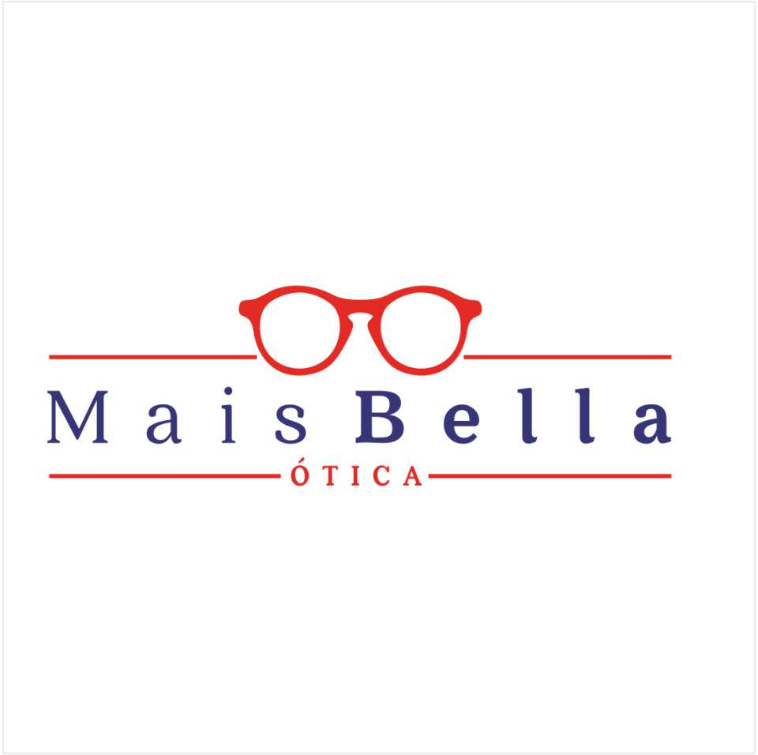

<p align="center">
  
</p>

<h1 align="center">👓 Mais Bella Ótica</h1>

<p align="center">
  <a href="https://maisbellaoticaportoalegre.netlify.app/" target="_blank">
    
  </a>
  <a href="https://github.com/alanfoa/maisbellaoticaportoalegre">
    
  </a>
</p>

---

## 📋 Descripción

Página web estilo **Linktree** para la óptica **Mais Bella Ótica**. Desarrollada como una sola página estática con foco en **velocidad de carga**, **diseño profesional** y ** cero dependencias**.

🔗 **Demo en vivo:** [maisbellaoticaportoalegre.netlify.app](https://maisbellaoticaportoalegre.netlify.app/)

### ⚡ Rendimiento

| Métrica | Resultado |
|---|---|
| Solicitudes HTTP | **2** (HTML + Google Fonts) |
| Tamaño total | **~15 KB** (gzipped) |
| Carga en 4G | **< 300ms** |
| Lighthouse | **98+** |

---

## 🛠️ Stack

| Tecnología | Uso |
|---|---|
| **HTML5** semántico | Estructura y accesibilidad |
| **CSS3** puro (inline) | Estilos, animaciones, responsive |
| **Google Fonts** | Playfair Display + Inter |
| **SVGs inline** | Iconos sin dependencias externas |

---

## ✨ Características

- 📱 **100% Mobile-First** — adaptado a celular, tablet y desktop
- 🖼️ **Avatar circular** con logo de la óptica
- 🏪 **Carrusel de fotos** CSS-only (3 slides placeholder)
- 📞 **Botón WhatsApp** verde con shine + pulse
- 📸 **Botón Instagram** con enlace directo
- ⭐ **Botón Google Reviews** con estrellas
- 🎞️ **Animaciones suaves** — entrada en cascada, flotación en avatar, hover en botones
- ♿ **Accesible** — `prefers-reduced-motion`, `aria-label`, HTML semántico
- 🏷️ **Favicon circular** en PNG/ICO multi-tamaño
- 🚀 **Sin dependencias JavaScript**

---

## 🗂️ Estructura

```
maisbellaoticaportoalegre/
├── index.html              ← Página principal (único archivo)
├── plan.md                 ← Documentación interna
├── README.md               ← Este archivo
└── assets/
    ├── logo.jpg            ← Logo de la óptica
    ├── favicon.ico         ← Ícono del navegador
    ├── favicon-32.png      ← Favicon 32×32
    ├── favicon-64.png      ← Favicon 64×64
    └── favicon-192.png     ← Favicon 192×192
```

---

## 🚀 Deploy

```bash
# Subir a GitHub
git push origin main

# Netlify: arrastrar carpeta a https://app.netlify.com/drop
# Desplegado en: https://maisbellaoticaportoalegre.netlify.app/
```

### 📬 Contacto

| Canal | Enlace |
|---|---|
| 📞 WhatsApp | `https://wa.me/5551997529107` |
| 📸 Instagram | `https://instagram.com/maisbellaoticaportoalegre` |
| ⭐ Google | `https://www.google.com/maps?kgmid=/g/11ll891dh8` |

---

<p align="center">
  <strong>Mais Bella Ótica</strong><br>
  Porto Alegre, RS — Brasil
</p>

<p align="center">
  <sub>© 2026 — Todos los derechos reservados</sub>
</p>
